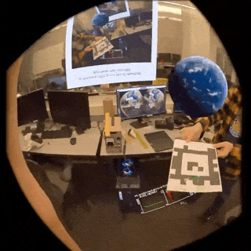

# Quest Display Access Demo

Developers want camera access on the Meta Quest. Meta hasn't let us have it yet. The next best thing is display access. Thanks to Android's MediaProjector API, you can copy the display image to a texture in your Unity project with minimal latency as demonstrated in this horribly architected Unity project. No PC, embedded browser, or dev mode required

Demo from [apriltags](https://github.com/trev3d/QuestDisplayAccessDemo/tree/apriltags) branch

## ⚠️ Issues (please read)!

### To fix 

⚠️ The code for copying the texture to Unity is a CPU byte array copy. I'm trying to fix this in the '[gltexture](https://github.com/trev3d/QuestDisplayAccessDemo/tree/gltexture)' branch

⚠️ This demo project only creates a single MediaProjector session on app launch. If the app is interrupted (such as by the headset going to sleep) the session will end and you'll need to restart the app. 

### Gotchas

⚠️ You may need to be on Quest system software v68 or higher 

⚠️ You cannot video record the display 'normally' while this app's MediaProjector session is running. You can instead use [scrcpy](https://github.com/Genymobile/scrcpy) to record any prototypes or demos you make with this.

⚠️ This still isn't proper camera access. Any virtual elements will obscure physical objects in the image. If you need to track something, you must not render anything on top of it!

### Other info

- The captured view is ~82 degrees in horizontal and vertical FOV on Quest 3
- The texture is 1024x1024, at least on Quest 3

## Reference

- [https://developer.oculus.com/documentation/native/native-media-projection/](https://developer.oculus.com/documentation/native/native-media-projection/)
- [https://developer.android.com/media/grow/media-projection](https://developer.android.com/media/grow/media-projection)
- [https://github.com/android/media-samples/tree/main/ScreenCapture](https://github.com/android/media-samples/tree/main/ScreenCapture)
